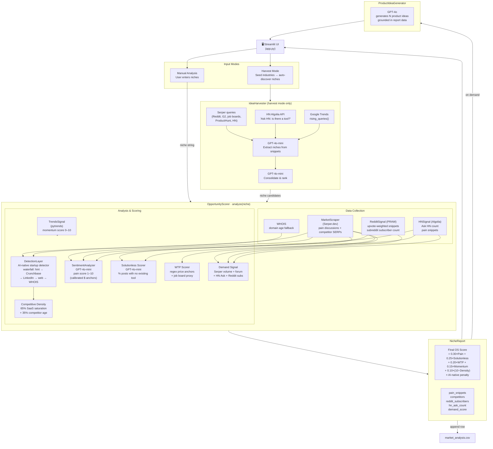

# nicheIQ

**Quantitative B2B niche intelligence.** Enter an industry keyword and get a scored market-gap report — pain intensity, solutionless rate, willingness to pay, market momentum, competitive density — plus AI-generated product ideas grounded in real evidence.


---

## Architecture



---

## How It Works

### Two Entry Points

**Manual Analysis** — paste one niche per line (e.g. `fleet maintenance scheduling`). Each is scored immediately.

**Harvest Mode** — provide seed industries (e.g. `construction, HR, logistics`). The `IdeaHarvester` mines Reddit, G2, job boards, ProductHunt, and HN for raw pain signals, then uses GPT-4o-mini twice: once to extract niche candidates from batched snippets, and once to consolidate and de-duplicate them. The resulting niche list is then scored normally.

---

### The Scoring Pipeline

Each niche runs through `OpportunityScorer.analyze()`, which fires several parallel data-collection and analysis steps:

#### 1. Pain Evidence — `MarketScraper` + `RedditSignal` + `HNSignal`

- **Serper.dev** queries three templates against Google: `"how to" {keyword} problem`, `"problem with" {keyword}`, `{keyword} "not working" OR "struggling"`. Returns up to 20 pain snippets.
- **Reddit (PRAW)** searches r/all sorted by top/year for community-validated complaints. Snippets are prefixed with `[r/subreddit, Xup]` so the LLM can weight by upvote count.
- **HN Algolia** fetches community-validated stories (≥5 points) and counts `Ask HN` posts — a direct signal that someone publicly couldn't find a solution.

#### 2. Competitor Discovery — `MarketScraper` + `DetectionLayer`

- Serper fetches the top-10 organic results for the bare keyword, filtering out known content/media domains (Reddit, YouTube, Medium, etc.).
- Each candidate domain passes through the **`DetectionLayer`** waterfall to determine founding year and AI-native status:
  1. Hint snippet (free, from the SERP result already in hand)
  2. Crunchbase via Serper `site:` search (confidence 0.90)
  3. LinkedIn company page (confidence 0.80)
  4. General web "founded in" query (confidence 0.60)
  5. WHOIS domain registration date (confidence 0.40)
- AI-native detection requires **both** a founding year in 2024–2026 **and** at least one AI keyword match in site snippets.

#### 3. Five Scored Signals

| Signal | Weight | Method |
|---|---|---|
| **Pain Intensity** | 30% | GPT-4o-mini rates financial/time cost with calibrated anchors (2 = annoyance → 10 = business failure risk) |
| **Solutionless Rate** | 25% | GPT-4o-mini counts posts with no existing tool mentioned; HN Ask posts add a +0.15 bonus each (capped +1.5) |
| **Willingness to Pay** | 20% | Regex for price anchors (`$X/mo`, `costs $X`) in snippets + LinkedIn/Indeed job posting count for manual-role titles |
| **Market Momentum** | 15% | `TrendsSignal` compares last-12-week vs trailing-52-week Google Trends average; falls back to Serper volume ratio if rate-limited |
| **Market Space** | 10% | `10 − competitive_density`; density = 65% SaaS saturation on SERP page 1 + 35% competitor age blend (younger avg = more crowded) |

#### 4. Final Score Formula

```
Raw = 0.30×Pain + 0.25×Solutionless + 0.20×WTP + 0.15×Momentum + 0.10×(10 − Density)

AI-native penalty:
  1 rival  → ×0.90
  2 rivals → ×0.75
  3 rivals → ×0.55
  4+ rivals → ×0.40

Final OS Score = min(Raw × penalty, 10.0)
```

Scores are tiered: **≥7.5 Underserved**, **≥6.0 High Potential**, **≥4.5 Contested**, **<4.5 Saturated**.

#### 5. Product Idea Generation

After analysis, click **Generate Product Ideas**. `ProductIdeaGenerator` calls GPT-4o with the full report context — competitors, pain snippets, scores — and returns N structured ideas, each with: name, one-liner, target user (hyper-specific), core feature, differentiation, pricing model, and 4–6-week MVP scope.

---

## Setup

### Prerequisites

- Python 3.10+
- API keys: `SERPER_API_KEY`, `OPENAI_API_KEY`
- Optional (improve signal quality): `REDDIT_CLIENT_ID`, `REDDIT_CLIENT_SECRET`

### Install

```bash
pip install -r requirements.txt
```

### Configure

Create a `.env` file in the project root:

```env
SERPER_API_KEY=your_serper_key
OPENAI_API_KEY=your_openai_key

# Optional — enables Reddit pain snippets and community size signal
REDDIT_CLIENT_ID=your_reddit_client_id
REDDIT_CLIENT_SECRET=your_reddit_client_secret
```

For Reddit credentials: go to [reddit.com/prefs/apps](https://www.reddit.com/prefs/apps), create a "script" app, and copy the client ID and secret.

### Run

```bash
streamlit run app.py
```

---

## Deploying to Streamlit Community Cloud

Add your keys under **Settings → Secrets** in the Streamlit Cloud dashboard. The app copies `st.secrets` into `os.environ` at startup before the engine loads, so no `.env` file is needed.

---

## Output

Every analysis appends a row to `market_analysis.csv`:

| Column | Description |
|---|---|
| `Niche` | Input keyword |
| `Pain_Intensity` | LLM pain score (0–10) |
| `Solutionless_Score` | % of posts with no tool (0–10) |
| `Willingness_To_Pay` | Budget signal (0–10) |
| `Momentum_Score` | Google Trends momentum (0–10) |
| `Competitive_Density` | SaaS saturation + age (0–10) |
| `AI_Native_Count` | AI-native rivals on page 1 |
| `Reddit_Subscribers` | Top-3 subreddit subscriber sum |
| `HN_Ask_Count` | "Ask HN: is there a tool?" post count |
| `Demand_Score` | Quality-weighted volume (0–10) |
| `Final_OS_Score` | Weighted opportunity score (0–10) |

---

## License

See [LICENSE](LICENSE).
